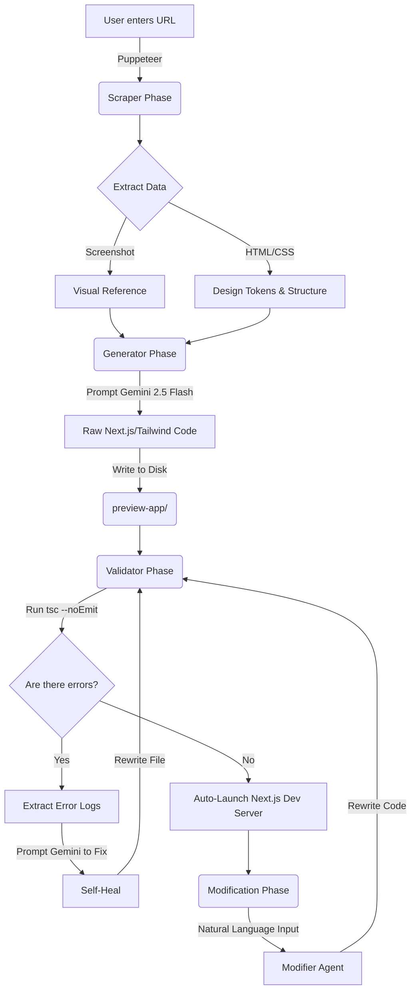

# AI Frontend Cloner Agent 🤖✨

An autonomous AI agent that takes a public website URL, scrapes its visual design and structure, and uses **Google Gemini 2.5 Flash** (Vision + Code) to generate a pixel-perfect, fully responsive Next.js/Tailwind CSS clone. 

It includes a **self-healing compilation loop** and an interactive **natural language modification** prompt to iteratively tweak the generated UI.

## 🚀 Features

- **Visual UI Cloning:** Uses multimodal vision to recreate exact layouts, colors, and typography from screenshots.
- **Autonomous Self-Healing:** Automatically runs the TypeScript compiler on the generated code. If there are syntax or import errors, the agent passes the compiler errors back to Gemini to fix itself (up to 5 retries).
- **Natural Language Modifications:** Instead of writing code, you can chat with the agent (e.g., *"Make the navbar sticky"* or *"Change the hero background to dark blue"*) and it will rewrite the Next.js components on the fly.
- **Next.js & Tailwind Native:** Outputs modern, clean `app/` router Next.js code.

---

## 🏗️ System Architecture

The project consists of two main parts:
1. **The CLI Agent** (Node.js/TypeScript): The brain of the operation. Contains the scraper, LLM generator, TypeScript validator, and modifier.
2. **The Preview App** (Next.js): The target directory where the generated React/Tailwind code is written and served.

### Agent Workflow Pipeline



---

## 🛠️ Prerequisites

- **Node.js** (v18+)
- **Google Gemini API Key** (Free tier works, but has rate limits)

## 📦 Installation & Setup

1. **Clone the repository:**
   ```bash
   git clone https://github.com/Abhij134/ai-frontend-agent.git
   cd ai-frontend-agent
   ```

2. **Install CLI Agent dependencies:**
   ```bash
   npm install
   ```

3. **Set up the Environment:**
   Create a `.env` file in the root directory:
   ```env
   GEMINI_API_KEY=your_gemini_api_key_here
   ```

4. **Scaffold the Next.js Preview Environment:**
   Run the setup script to create the clean Next.js target directory.
   ```bash
   npm run setup
   ```

## 🎮 Usage

Start the agent:
```bash
npm start
```

1. **Enter a URL:** The agent will scrape it, take a screenshot, and begin generating the Next.js components.
2. **Wait for Validation:** The AI will write the code and test it against the TypeScript compiler. If it fails, it will attempt to heal the code automatically.
3. **View the Clone:** Once validated, the dev server will start at `http://localhost:3000`.
4. **Modify:** In the terminal, a `Modification →` prompt will appear. You can type instructions like *"Make the background black"* and the AI will apply the changes, re-validate, and hot-reload your browser.

---

## 🧠 Core Agent Modules

- **`scraper.ts`**: Uses Puppeteer to load the target URL, extract the `computedStyle` (fonts, background colors, custom properties), and capture a full-page screenshot.
- **`generator.ts`**: Constructs a massive context prompt combining the screenshot and the extracted styles, forcing the Vision model to output raw Next.js components using standard Tailwind classes.
- **`validator.ts`**: The self-healing loop. Spawns `npx tsc` on the generated code. If it fails, it isolates the failing file and the specific error logs, prompting the AI to resolve the syntax/type issues.
- **`modifier.ts`**: Reads the entire generated codebase into context and applies user-requested natural language modifications to specific components.

## 🤝 Future Roadmap / Custom Models (e.g. HuggingFace)
This agent is currently hardcoded to use the `@google/genai` SDK. However, the architecture is model-agnostic. 

To use an open-source Vision-Language Model (VLM) like **Qwen2.5-VL** or **Llama-3.2-Vision**:
1. Host the model locally using `vLLM` or `Ollama` (provides an OpenAI-compatible endpoint).
2. Swap `@google/genai` for the `openai` SDK in the agent files.
3. Point the `baseURL` to your local endpoint.

*(See the `huggingface-approach` branch for integration patterns!)*
